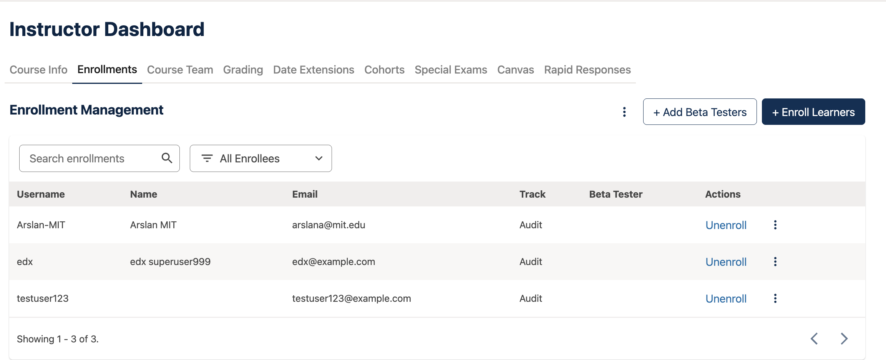
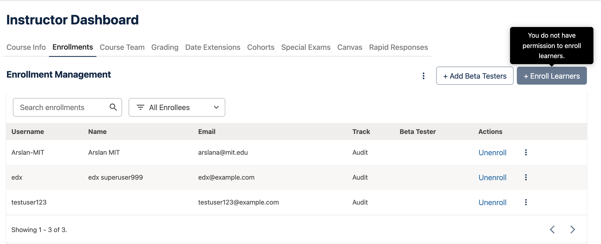

# Enrollment Actions Slot

### Slot ID: `org.openedx.frontend.slot.instructorDashboard.enrollmentActions.v1`

### Default Widget ID: `org.openedx.frontend.widget.instructorDashboard.enrollmentActions.default`

### Props:
* `permissions` - Course permission flags from the instructor course-info API (e.g. `admin`, `instructor`, `dataResearcher`). Provided so a widget can decide which actions to show; the MFE applies no gating.
* `onEnrollLearners` - Opens the Enroll Learners modal (owned by the Enrollments page).
* `onAddBetaTesters` - Opens the Add Beta Testers modal (owned by the Enrollments page).

## Description

This slot is used to replace/modify/hide the action buttons in the header of the **Enrollments**
tab. By default it renders **Add Beta Testers** and **Enroll Learners** with no permission gating,
so out of the box the behavior is unchanged.

The modals opened by these buttons stay owned by the Enrollments page and are triggered through the
`onEnrollLearners` / `onAddBetaTesters` handlers passed into the slot, so a replacement widget only
needs to render buttons and call the handlers — it does not reimplement the modals.

The slot ID, default widget ID, and the `EnrollmentActionsSlotProps` type are exported from the
package entry point for use in a `site.config`. Target the default widget ID with a `REPLACE`
operation to swap the buttons, or a `REMOVE` operation to hide them.

## Example

The following `site.config.tsx` replaces the default widget


with one that gates the buttons by
permission


```tsx
import { WidgetOperationTypes } from '@openedx/frontend-base';
import { Button, OverlayTrigger, Tooltip } from '@openedx/paragon';
import {
  EnrollmentActionsSlotProps,
  enrollmentActionsSlotId,
  enrollmentActionsWidgetId,
  instructorDashboardApp,
} from './src';

const GatedEnrollmentActions = ({ permissions, onEnrollLearners, onAddBetaTesters }: EnrollmentActionsSlotProps) => {
  const gatedButton = (canAccess: boolean, label: string, onClick: () => void, tooltip: string, variant?: string) => {
    const button = (
      <Button variant={variant} onClick={onClick} disabled={!canAccess} style={canAccess ? undefined : { pointerEvents: 'none' }}>
        + {label}
      </Button>
    );
    return canAccess ? button : (
      <OverlayTrigger placement="top" overlay={<Tooltip id={`${label}-disabled`}>{tooltip}</Tooltip>}>
        <span className="d-inline-block" tabIndex={0}>{button}</span>
      </OverlayTrigger>
    );
  };

  return (
    <>
      {gatedButton(Boolean(permissions?.instructor), 'Add Beta Testers', onAddBetaTesters, 'You do not have permission to add beta testers.', 'outline-primary')}
      {gatedButton(Boolean(permissions?.admin), 'Enroll Learners', onEnrollLearners, 'You do not have permission to enroll learners.')}
    </>
  );
};

// In your SiteConfig, on the instructor dashboard app entry:
const app = {
  ...instructorDashboardApp,
  slots: [
    ...(instructorDashboardApp.slots ?? []),
    {
      slotId: enrollmentActionsSlotId,
      id: 'org.openedx.frontend.widget.instructorDashboard.enrollmentActions.mysite',
      op: WidgetOperationTypes.REPLACE,
      relatedId: enrollmentActionsWidgetId,
      component: GatedEnrollmentActions,
    },
  ],
};
```
